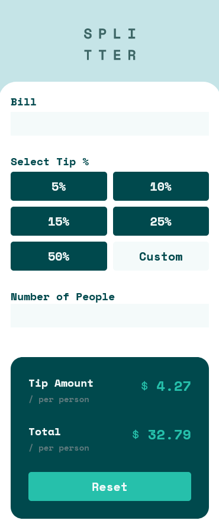
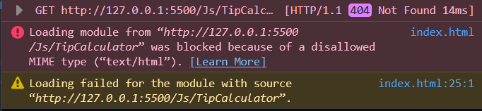

# Frontend Mentor - Tip calculator app solution

This is a solution to the [Tip calculator app challenge on Frontend Mentor](https://www.frontendmentor.io/challenges/tip-calculator-app-ugJNGbJUX). Frontend Mentor challenges help you improve your coding skills by building realistic projects.

## Table of contents

- [Frontend Mentor - Tip calculator app solution](#frontend-mentor---tip-calculator-app-solution)
  - [Table of contents](#table-of-contents)
  - [Overview](#overview)
    - [The challenge](#the-challenge)
    - [Screenshot](#screenshot)
        - [Mobile View](#mobile-view)
        - [Desktop View](#desktop-view)
    - [Links](#links)
  - [My process](#my-process)
    - [Built with](#built-with)
    - [What I learned](#what-i-learned)
      - [What I learn with the Javacript](#what-i-learn-with-the-javacript)
        - [Exports and Imports](#exports-and-imports)
    - [Continued development](#continued-development)
      - [HTML](#html)
      - [CSS](#css)
      - [Javascript](#javascript)
    - [Useful resources](#useful-resources)
  - [Author](#author)
  - [Acknowledgments](#acknowledgments)

**Note: Delete this note and update the table of contents based on what sections you keep.**

## Overview

### The challenge

Users should be able to:

- View the optimal layout for the app depending on their device's screen size
- See hover states for all interactive elements on the page
- Calculate the correct tip and total cost of the bill per person

### Screenshot
##### Mobile View


##### Desktop View


### Links

- [Github Repo](https://your-solution-url.com)
- [View Project](https://your-live-site-url.com)

## My process

### Built with

- Semantic HTML5 markup
- CSS custom properties
- Flexbox
- CSS Grid
- Mobile-first workflow
- Vanilla Javascript


### What I learned

- This was the first time I implemented the grid.
- I have learnt how to use the grid to position elements wherever I want.
- I have also learnt how to use the "gird-gap" property. However, VS Code warned that the property is absolute and should avoid using it.


#### What I learn with the Javacript
##### Exports and Imports
- I created two Js files, app.js and TipCalulator.js
- The TipCalculator.js contains a class
- Initially on the app.js I imported the TipCalculator as follows

```js
  import Calculator from './TipCalculator'
}
```
- I got the following error 


- To solve the problem I did a google search on [statckoverflow](https://stackoverflow.com/questions/59925804/blocked-because-of-a-disallowed-mime-type-text-html-angular-8-deployed-on).
- I put a .js extension at the import
```js
  import Calculator from './TipCalculator.js'
}
```


### Continued development

#### HTML
- In HTML i want to focus more on semantic tags
- Improve HTML structure
  
#### CSS
- Focus more on layouts using grid and flex box
- Focus on mobile first approach
- Responsive CSS
- Learn more about units (rem, em, px)

#### Javascript
- Focus on

### Useful resources

- [Example resource 1](https://www.example.com) - This helped me for XYZ reason. I really liked this pattern and will use it going forward.
- [Example resource 2](https://www.example.com) - This is an amazing article which helped me finally understand XYZ. I'd recommend it to anyone still learning this concept.


## Author

- Website - [Perfect Nkosi](https:github.com/PNkosi)
- Frontend Mentor - [@yourusername](https://www.frontendmentor.io/profile/yourusername)
- Twitter - [@yourusername](https://www.twitter.com/yourusername)


## Acknowledgments
